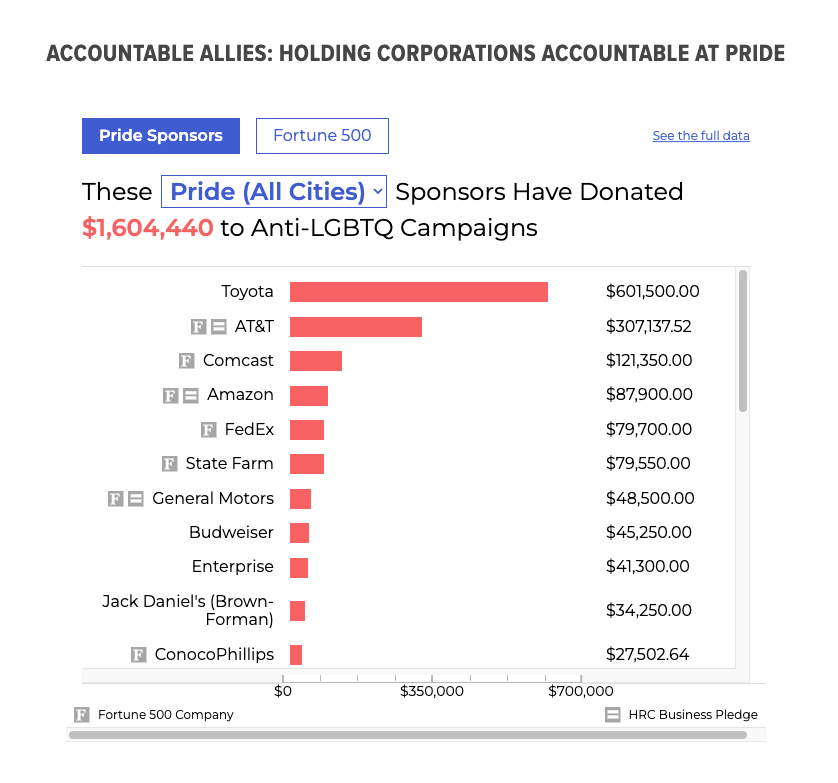
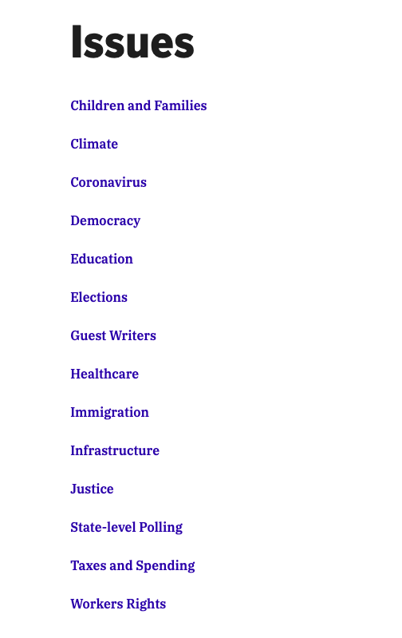
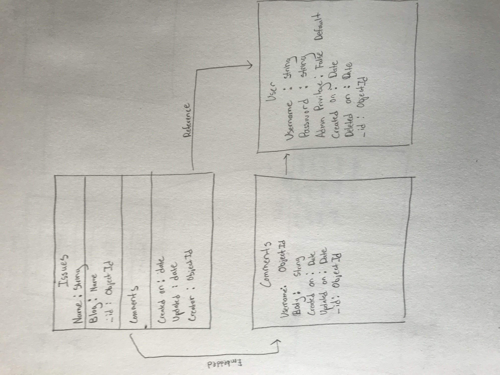
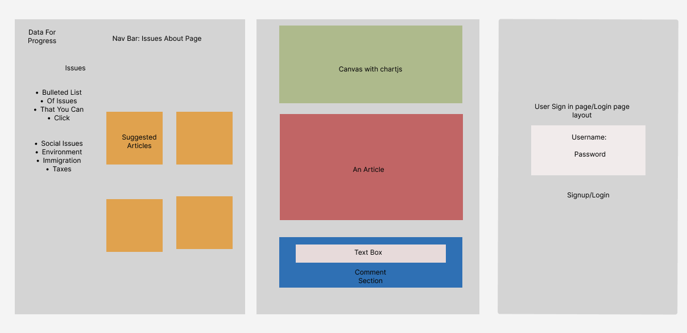
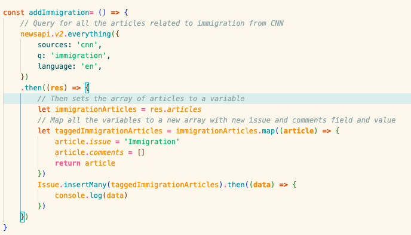

<h1><strong>Project Inspiration</strong></h1>

My project is a replica of a site called DataForProgress. The website is a progressive run blog site that displays data to support progressive causes. They create charts using data from their api provider or polling regarding any political or social issue to back progressive movements. Here is an example of a show page for an issue. 

<h1><strong>Planning</strong></h1>

For the project, I plan to establish an index page with a list of individual issues and clicking on each link will go to show routes for each issue which will be populated using chart.js. Data from the chart will be referenced using an api. There will be a blog below that does short summaries for each issue referenced and relevance. Below that there will be a comment section. In order to access the site, the user must create a login and password to enter to be able to comment. Not sure if I want to give the user access to the site. I might create an application to apply for admin privileges if the user is an approved journalist and want to add their own blogs and issues.

<h1><strong>MVP</strong></h1>

Minimum viable product will consist of a website with an index page, show pages, login, comments, editing comments, and deleting comments. Stretch goal is including admin privileges or journalist privileges. 

<h1><strong>User Experience</strong></h1>

On entry to the website, the user is greeted with a login/signup page that they must use before entering the site. Once logged in, the site populates a list using the NewsAPI to generate a list of topics. Upon clicking on a link in the list, they're sent to a show page with a block of 20 articles relevant to the topic clicked. At the bottom of the page, the user can read other people's comments, as well as creating, updating, and deleting their own. 

<h1><strong>ERD</strong></h1>

<h1><strong>Wireframe</strong></h1>

<h1><strong>Example Code</strong></h1>

An example of code that took me a long time to figure out was mapping out the array that my article query returned so that I had an issues tag attached to each article I queried.

<h1><strong>Resources Used</strong></h1>

https://newsapi.org/ - News Api locates articles and news headlines from news sources and blogs and renders the information in JSON format.

